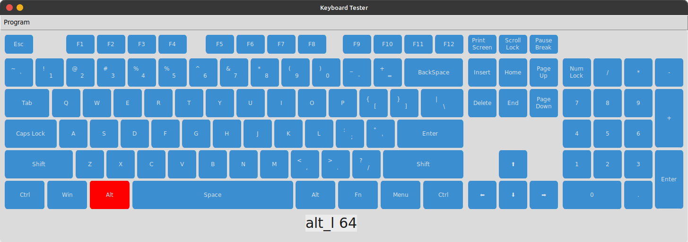

# keyboard_tester

Keyboard Tester
-
A small program designed to check whether the keyboard keys are not working. The program is not scaled, so use a monitor scale of 100%. And if the monitor width is less than 1455 pixels, you will not see the whole program in its entirety.

How to solve these problems with Tkinter. If you have any thoughts on this, please leave a comment.

The modules in the requirements.txt file are installed by issuing the following command in the terminal.

<pre>pip install -r requirements.txt</pre>

The remaining modules are standard python modules. Run the main.py file to run the game.

Use the pyinstaller module to convert the game to .exe format. And run the following command in the terminal :

<pre>pyinstaller main.py --onefile -w</pre>

List of modules needed to create a program 
-
+ customtkinter

+ tkinter

©️<a href="t.me/@uzbek_coder_2022"> Created by Khusanboy Sobirjonov </a>
